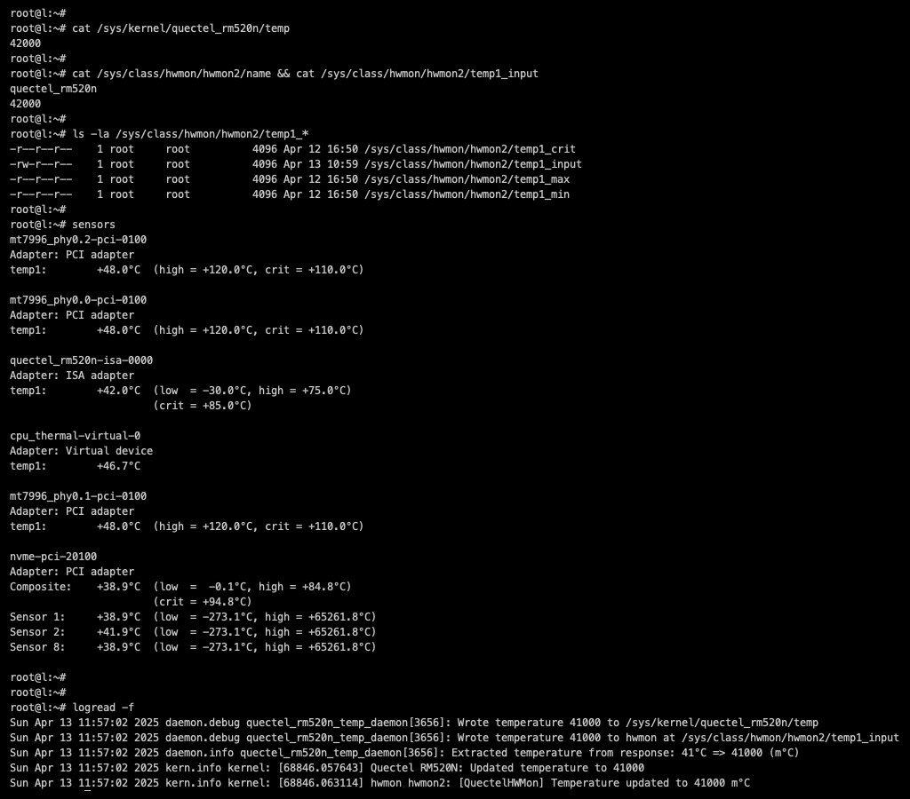

# Quectel RM520N Thermal Management Tools

Comprehensive tools and kernel modules for monitoring and managing Quectel modem temperature on OpenWrt.

[](LICENSE)
[](https://openwrt.org/)

## Table of Contents

- [Features](#features)
- [Screenshot](#screenshot)
- [Components](#components)
- [Requirements](#requirements)
- [Installation](#installation)
- [Usage](#usage)
- [Configuration](#configuration)
- [Thermal Framework Integration](#thermal-framework-integration)
- [Device Tree Configuration](#device-tree-configuration)
- [Troubleshooting](#troubleshooting)

## Features

- **Linux Thermal Framework Integration**: Full integration with the Linux kernel thermal subsystem for proper thermal management
- **Device Tree Configuration**: Trip points, cooling devices, and thermal policies configured via Device Tree for automatic thermal response
- **Automatic Thermal Events**: Kernel automatically sends uevents when trip points are crossed, no userspace polling needed for alerts
- **hwmon Standard Interface**: Standard `/sys/class/hwmon/` interface for compatibility with all Linux monitoring tools
- **Cooling Device Support**: Can bind to cooling devices (fans, throttling) via Device Tree cooling-maps for automatic thermal control
- **OpenWrt Integration**: Fully compatible with OpenWrt build systems for seamless integration into custom firmware builds
- **Configurable Daemon**: Userspace daemon reads modem temperature via AT commands and updates kernel thermal zones
- **CLI Tool**: Command-line interface for manual temperature reading with JSON output support
- **Prometheus Metrics**: Optional ucode collector package for integration with prometheus-node-exporter-ucode
- **Fallback Mechanisms**: Works without Device Tree for basic monitoring on systems without DT support
- **Open Source**: Licensed under the GNU General Public License for maximum flexibility

**Note**: This package is designed to work with any modem that supports AT+QTEMP command and provides temperature data in a similar format to the Quectel RM520N. The temperature parsing prefixes are configurable via UCI to support different modem models and response formats.

## Screenshot



*Screenshot showing the thermal management system in action: kernel sysfs interface, hwmon integration, sensors output displaying temperature thresholds, and daemon logs updating temperature values.*

## Components

- **Kernel Modules**: Three specialized modules for sysfs, thermal sensors, and hwmon integration
- **Userspace Tool**: Combined daemon and CLI with subcommands (`read`, `daemon`, `config`)
- **Configuration**: UCI-based configuration with automatic service reload
- **Service Management**: OpenWrt procd integration with auto-restart

## Requirements

- OpenWrt 24.10.x or later
- Quectel modem with AT+QTEMP support (RM520N-GL or compatible)
- Serial port access to modem (typically /dev/ttyUSB2 or /dev/ttyUSB3)

## Installation

### From Package Feed

You can setup this package feed to install and update it with opkg:

[https://github.com/Zerogiven-OpenWRT-Packages/package-feed](https://github.com/Zerogiven-OpenWRT-Packages/package-feed)

### From IPK Package

```bash
opkg install kmod-quectel-rm520n-thermal.ipk
opkg install quectel-rm520n-thermal.ipk

# Optional: Install Prometheus metrics collector
opkg install prometheus-node-exporter-ucode-quectel-rm520n-thermal.ipk
```

### From Source

```bash
git clone https://github.com/Zerogiven-OpenWRT-Packages/Quectel-RM520N-Thermal.git package/quectel-rm520n-thermal
make menuconfig  # Navigate to: Utilities → Quectel RM520N Thermal Management Tools
make package/quectel-rm520n-thermal/compile V=s
```

**Note**: Service starts automatically after installation.

## Usage

### Quick Start

```bash
# Read temperature (uses daemon data if available)
quectel_rm520n_temp

# Start daemon service
/etc/init.d/quectel_rm520n_thermal start

# Check daemon and service status
quectel_rm520n_temp status
/etc/init.d/quectel_rm520n_thermal status
```

### CLI Commands

```bash
# Read temperature (default mode, returns millidegrees)
quectel_rm520n_temp

# Return temperature in degrees Celsius
quectel_rm520n_temp --celsius

# JSON output
quectel_rm520n_temp --json

# JSON output in degrees Celsius
quectel_rm520n_temp --json --celsius

# Watch mode - continuously monitor temperature
quectel_rm520n_temp --watch

# Watch mode with JSON output
quectel_rm520n_temp --watch --json

# Debug mode
quectel_rm520n_temp --debug

# Help
quectel_rm520n_temp --help
```

### Service Management

```bash
# Start/stop service
/etc/init.d/quectel_rm520n_thermal start|stop|restart

# Check status
/etc/init.d/quectel_rm520n_thermal status

# Update config
quectel_rm520n_temp config
```

### Temperature Interfaces

- **Hwmon**: `/sys/class/hwmon/hwmonX/temp1_input` (primary)
- **Kernel**: `/sys/kernel/quectel_rm520n_thermal/temp`
- **Thermal**: `/sys/devices/virtual/thermal/thermal_zoneX/temp`

### Temperature Output Format

- **Default**: Returns temperature in millidegrees (e.g., `43000` for 43°C)
- **Celsius Option**: Use `--celsius` flag to return temperature in degrees (e.g., `43`)
- **Watch Mode**: Use `--watch` flag to continuously monitor temperature (interval configurable via UCI)
- **Consistent**: Both daemon and direct AT command modes return the same format

## Configuration

The thermal management system is configured through the UCI (Unified Configuration Interface) system. The main configuration file is located at `/etc/config/quectel_rm520n_thermal`.

### Basic Settings

| Option | Type | Default | Description |
|--------|------|---------|-------------|
| `serial_port` | string | `/dev/ttyUSB2` | Serial port device for modem communication |
| `baud_rate` | integer | `115200` | Serial communication baud rate (9600, 19200, 38400, 57600, 115200) |
| `interval` | integer | `10` | Temperature monitoring interval in seconds |
| `enabled` | boolean | `1` | Enable/disable the thermal management service |
| `auto_start` | boolean | `1` | Automatically start service on boot |
| `log_level` | string | `info` | Logging level: `debug`, `info`, `warning`, or `error` |

### Temperature Thresholds

| Option | Type | Default | Description |
|--------|------|---------|-------------|
| `temp_min` | integer | `-30` | Minimum temperature threshold in °C |
| `temp_max` | integer | `75` | Maximum temperature threshold in °C |
| `temp_crit` | integer | `85` | Critical temperature threshold in °C |
| `temp_default` | integer | `40` | Default temperature value in °C when reading fails |
| `error_value` | string | `N/A` | Value to display when temperature reading fails |
| `fallback_register` | boolean | `1` | Enable fallback to register-based temperature reading |

### Temperature Parsing Prefixes

These options allow the system to work with different modem models by configuring how temperature values are parsed from AT+QTEMP responses:

| Option | Type | Default | Description |
|--------|------|---------|-------------|
| `temp_modem_prefix` | string | `modem-ambient-usr` | Prefix for modem ambient temperature |
| `temp_ap_prefix` | string | `cpuss-0-usr` | Prefix for AP/CPU temperature |
| `temp_pa_prefix` | string | `modem-lte-sub6-pa1` | Prefix for power amplifier temperature |

### Example Configuration

```ini
config quectel_rm520n_thermal 'settings'
    # Basic communication settings
    option serial_port '/dev/ttyUSB3'
    option baud_rate '115200'
    option interval '10'

    # Service control
    option enabled '1'
    option auto_start '1'
    option log_level 'info'

    # Temperature thresholds (in °C, converted to m°C internally)
    option temp_min '-30'
    option temp_max '75'
    option temp_crit '85'
    option temp_default '40'
    option error_value 'N/A'
    option fallback_register '1'
    
    # Temperature parsing prefixes (configurable for different modem models)
    option temp_modem_prefix 'modem-ambient-usr'
    option temp_ap_prefix 'cpuss-0-usr'
    option temp_pa_prefix 'modem-lte-sub6-pa1'
```

### Modem Compatibility

This package works with any modem that:

- Supports AT+QTEMP command
- Returns temperature data in a format similar to Quectel RM520N
- Uses a ttyUSB serial port for communication

## Thermal Framework Integration

This package provides full integration with the Linux kernel thermal framework, the standard way to handle thermal management in Linux systems.

### Standard Interfaces

The thermal zone exposes standard Linux interfaces:

```bash
# Thermal zone
/sys/class/thermal/thermal_zoneX/
├── temp                    # Current temperature (millidegrees)
├── type                    # "quectel_rm520n_modem"
├── mode                    # enabled/disabled
├── trip_point_0_temp       # Critical trip point (from DTS)
├── trip_point_0_type       # "critical"
├── trip_point_1_temp       # Hot trip point (from DTS)
├── trip_point_1_type       # "hot"
└── ...

# hwmon interface (for monitoring tools)
/sys/class/hwmon/hwmonX/
├── temp1_input            # Current temperature (millidegrees)
├── temp1_min              # Minimum threshold
├── temp1_max              # Maximum threshold
└── temp1_crit             # Critical threshold
```

### With vs Without Device Tree

**With Device Tree (Recommended):**

- Trip points defined in DTS
- Automatic thermal events from kernel
- Can bind to cooling devices
- Full thermal management

**Without Device Tree (Fallback):**

- Basic temperature monitoring only
- No automatic trip point handling
- Manual monitoring via hwmon/sysfs
- No cooling device integration

## Device Tree Configuration

For full thermal framework integration with automatic trip point handling and cooling device support, configure the thermal zone in your Device Tree.

### Basic Thermal Zone (Monitoring Only)

```dts
/ {
    thermal-zones {
        modem_thermal: modem-thermal {
            polling-delay-passive = <5000>;   /* Poll every 5s when trip point active */
            polling-delay = <10000>;          /* Poll every 10s normally */
            thermal-sensors = <&quectel_temp_sensor>;

            trips {
                modem_crit: crit {
                    temperature = <85000>;    /* 85°C in millidegrees */
                    hysteresis = <5000>;      /* 5°C hysteresis */
                    type = "critical";        /* Emergency shutdown */
                };

                modem_hot: hot {
                    temperature = <80000>;    /* 80°C */
                    hysteresis = <5000>;
                    type = "hot";             /* High temperature warning */
                };

                modem_active_high: active-high {
                    temperature = <75000>;    /* 75°C */
                    hysteresis = <5000>;
                    type = "active";          /* Active cooling level 3 */
                };

                modem_active_med: active-med {
                    temperature = <70000>;    /* 70°C */
                    hysteresis = <5000>;
                    type = "active";          /* Active cooling level 2 */
                };

                modem_active_low: active-low {
                    temperature = <65000>;    /* 65°C */
                    hysteresis = <5000>;
                    type = "active";          /* Active cooling level 1 */
                };
            };
        };
    };
};
```

### With Cooling Device (Fan Control)

To bind trip points to a cooling device (e.g., PWM fan), add cooling-maps:

```dts
/ {
    thermal-zones {
        modem_thermal: modem-thermal {
            polling-delay-passive = <5000>;
            polling-delay = <10000>;
            thermal-sensors = <&quectel_temp_sensor>;

            trips {
                modem_crit: crit {
                    temperature = <85000>;
                    hysteresis = <5000>;
                    type = "critical";
                };

                modem_active_high: active-high {
                    temperature = <75000>;
                    hysteresis = <5000>;
                    type = "active";
                };

                modem_active_med: active-med {
                    temperature = <70000>;
                    hysteresis = <5000>;
                    type = "active";
                };

                modem_active_low: active-low {
                    temperature = <65000>;
                    hysteresis = <5000>;
                    type = "active";
                };
            };

            cooling-maps {
                /* Map active-low trip (65°C) to fan speed 1 */
                map0 {
                    trip = <&modem_active_low>;
                    cooling-device = <&fan 1 1>;  /* Set fan to speed level 1 */
                };

                /* Map active-med trip (70°C) to fan speed 2 */
                map1 {
                    trip = <&modem_active_med>;
                    cooling-device = <&fan 2 2>;  /* Set fan to speed level 2 */
                };

                /* Map active-high trip (75°C) to fan speed 3 (max) */
                map2 {
                    trip = <&modem_active_high>;
                    cooling-device = <&fan 3 3>;  /* Set fan to maximum speed */
                };
            };
        };
    };
};
```

**Note**: Replace `<&fan>` with your actual cooling device phandle. Common cooling devices: PWM fans (`<&pwm_fan>`), GPIO fans (`<&gpio_fan>`), CPU frequency scaling (`<&cpu0>` for passive cooling/throttling).

### Trip Point Types

- **critical**: Emergency level - kernel may trigger shutdown
- **hot**: High temperature warning, logged to kernel messages
- **active**: Activate cooling devices (fans, etc.)
- **passive**: Reduce device performance (throttling)

See `quectel_rm520n_thermal_overlay.dts.example` in the project root for a complete Device Tree overlay example.

## Troubleshooting

### Common Issues

| Issue | Solution |
|-------|----------|
| Service not starting | Check serial port permissions and UCI config |
| Temperature showing 0 | Verify modem connection and AT command responses |
| Hwmon not found | Ensure kernel modules are loaded |
| Wrong temperature values | Check temperature parsing prefixes in UCI config |

### Debug Mode

```bash
# Enable debug logging
uci set quectel_rm520n_thermal.settings.log_level='debug'
uci commit quectel_rm520n_thermal
/sbin/reload_config

# Check logs
logread | grep quectel

# Disable debug logging (return to info level)
uci set quectel_rm520n_thermal.settings.log_level='info'
uci commit quectel_rm520n_thermal
/sbin/reload_config
```

### Finding Hwmon Interface

```bash
# List all hwmon devices
ls /sys/class/hwmon/

# Find Quectel device
for hwmon in /sys/class/hwmon/*; do \
  if [ "$(cat $hwmon/name)" = "quectel_rm520n_thermal" ]; then \
    echo "Found: $hwmon"; \
  fi; \
done
```

### Different Modem Models

If using a different modem model, check the AT+QTEMP response format and adjust the temperature prefixes:

```bash
# Test AT command manually
echo "AT+QTEMP" | socat - /dev/ttyUSB3

# Update prefixes in UCI config
uci set quectel_rm520n_thermal.settings.temp_modem_prefix='your-modem-prefix'
uci set quectel_rm520n_thermal.settings.temp_ap_prefix='your-ap-prefix'
uci set quectel_rm520n_thermal.settings.temp_pa_prefix='your-pa-prefix'
uci commit quectel_rm520n_thermal
/sbin/reload_config
```
